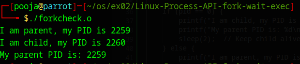

# Linux-IPC-Pipes

# Ex03 - Linux IPC - Pipes

## AIM:
To write a C program that illustrates communication between two processes using unnamed and named pipes.

---

## DESIGN STEPS:

Step 1: Use Linux environment (Parrot OS / VM / JSLinux)

Step 2: Write programs using pipe() and mkfifo()

Step 3: Compile and execute and verify output

---

## PROGRAM

### Unnamed Pipe Output

---

### Named Pipe Output

---

## RESULT:
Linux IPC programs using unnamed and named pipes executed successfully.
